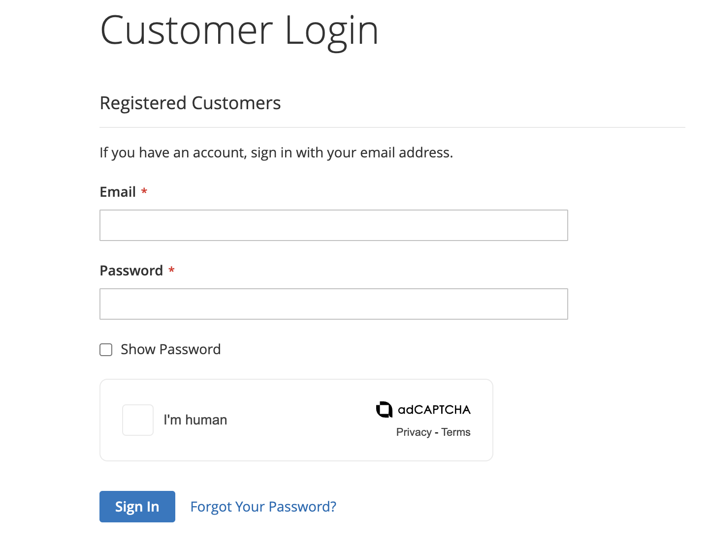
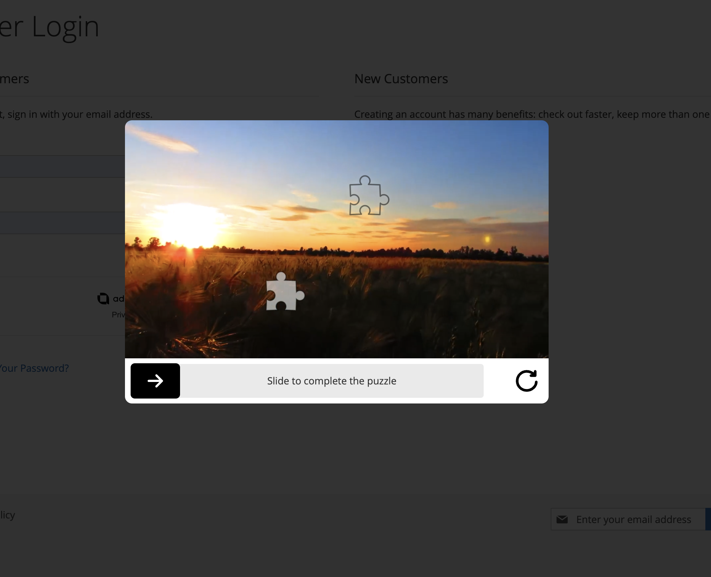

# adCAPTCHA for Magento

[adCAPTCHA](https://adcaptcha.com) offers a unique proposition in the digital space by combining Security, Marketing and UX to form a product which beats Bots and elevates brands. Current solutions offer structured challenges and often collect user data which by their nature provides vulnerabilities when protecting against Bots. We collect no user data and offer limitless variables by the nature of Brand's ever changing content.

Trigger | adCAPTCHA Challenge
--- | ---
 | 

## Supported Forms

### Frontend Forms

- Contact
- Login
- Register
- Reset password
- Review
- Send product to friend

### Admin Forms

- Login
- Reset password

## Privacy Notices

adCAPTCHA adheres to GDPR regulations.

This plugin intentionally avoids the use of cookies, refrains from tracking users, storing personal data, or engaging with unnecessary external services during the verification process.

During verification, the adCAPTCHA service may briefly receive the user's IP address and browser vendor data to safeguard enabled pages. However, it promptly discards this information after verification and does not retain any data. Importantly, none of the information utilized for verification enables adCAPTCHA to identify individual users.

[Privacy Policy](https://adcaptcha.com/privacy).